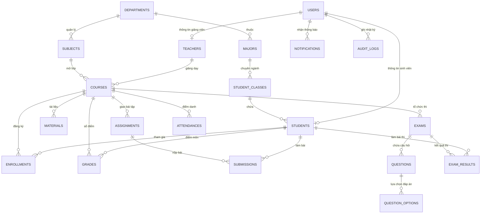

# Sơ đồ Quan hệ Thực thể (ERD) - Hệ thống LMS

```mermaid
erDiagram
    DEPARTMENTS ||--o{ MAJORS : "thuộc"
    DEPARTMENTS ||--o{ SUBJECTS : "quản lý"
    MAJORS ||--o{ STUDENT_CLASSES : "chuyên ngành"
    STUDENT_CLASSES ||--o{ STUDENTS : "chứa"
    
    USERS ||--o| STUDENTS : "thông tin sinh viên"
    USERS ||--o| TEACHERS : "thông tin giảng viên"
    
    SUBJECTS ||--o{ COURSES : "mở lớp"
    TEACHERS ||--o{ COURSES : "giảng dạy"
    
    COURSES ||--o{ ENROLLMENTS : "đăng ký"
    STUDENTS ||--o{ ENROLLMENTS : "tham gia"
    
    COURSES ||--o{ MATERIALS : "tài liệu"
    COURSES ||--o{ ASSIGNMENTS : "giao bài tập"
    COURSES ||--o{ EXAMS : "tổ chức thi"
    COURSES ||--o{ GRADES : "sổ điểm"
    COURSES ||--o{ ATTENDANCES : "điểm danh"
    
    ASSIGNMENTS ||--o{ SUBMISSIONS : "nộp bài"
    STUDENTS ||--o{ SUBMISSIONS : "làm bài"
    
    EXAMS ||--o{ QUESTIONS : "chứa câu hỏi"
    QUESTIONS ||--o{ QUESTION_OPTIONS : "lựa chọn đáp án"
    EXAMS ||--o{ EXAM_RESULTS : "kết quả thi"
    STUDENTS ||--o{ EXAM_RESULTS : "làm bài thi"
    
    STUDENTS ||--o{ GRADES : "điểm môn"
    USERS ||--o{ NOTIFICATIONS : "nhận thông báo"
    USERS ||--o{ AUDIT_LOGS : "ghi nhật ký"
```