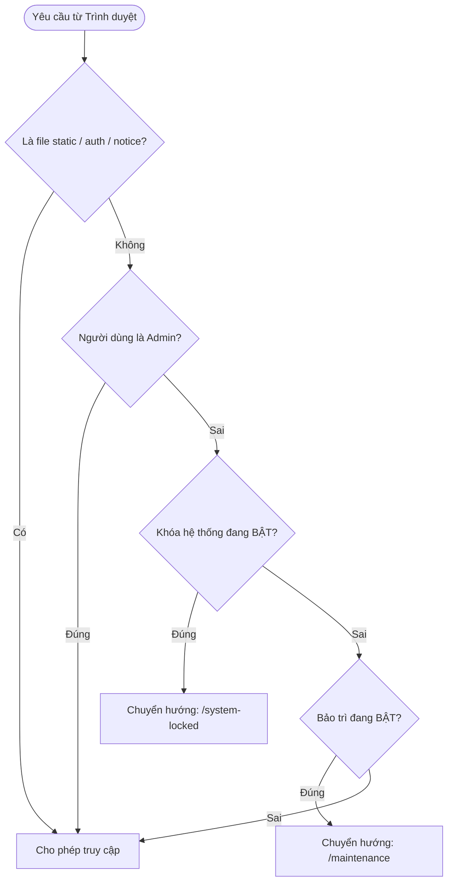

# 🎓 University Learning Management System (LMS)
> **Hệ thống Quản lý Học tập Trực tuyến Chuẩn Đại học**  
> *Nền tảng đào tạo toàn diện, phân quyền 3 cấp (Admin – Giảng viên – Sinh viên), tích hợp phân tích dữ liệu đa chiều, thông báo thời gian thực và kiểm soát hệ thống tập trung.*

---

## 📌 Mục Lục
1. [Giới thiệu Tổng quan](#-giới-thiệu-tổng-quan)
2. [Tài khoản Demo Thử nghiệm](#-tài-khoản-demo-thử-nghiệm)
3. [Hướng dẫn Cài đặt & Khởi chạy](#-hướng-dẫn-cài-đặt--khởi-chạy)
4. [Bộ Dữ liệu Chuẩn hóa Toàn trường](#-bộ-dữ-liệu-chuẩn-hóa-toàn-trường)
5. [Chi tiết Chức năng theo Phân quyền](#-chi-tiết-chức-năng-theo-phân-quyền)
   - [5.1. Quản trị viên (Admin)](#51-quản-trị-viên-admin)
   - [5.2. Giảng viên (Teacher)](#52-giảng-viên-teacher)
   - [5.3. Sinh viên (Student)](#53-sinh-viên-student)
6. [Chế độ Kiểm soát Hệ thống (Bảo trì & Khóa)](#-chế-độ-kiểm-soát-hệ-thống)
7. [Báo cáo, Thống kê & Biểu đồ Trực quan](#-báo-cáo-thống-kê--biểu-đồ-trực-quan)
8. [Cấu trúc Thư mục Dự án](#-cấu-trúc-thư-mục-dự-án)
9. [Kiểm thử & Đảm bảo Chất lượng](#-kiểm-thử--đảm-bảo-chất-lượng)

---

## 🌟 Giới thiệu Tổng quan

Hệ thống **University LMS** là giải pháp phần mềm quản lý học tập và đào tạo trực tuyến dành cho các trường đại học, cao đẳng:
- **Giao diện hiện đại & Đồng nhất:** Thiết kế Sidebar cố định tone màu xanh Navy đậm (`#0F172A`), menu chuyển trạng thái màu tím viền dải hồng (`#EC4899`), 100% Responsive trên Mobile, Tablet và Desktop.
- **Nghiệp vụ đào tạo chuẩn mực:** Quản lý trọn vẹn từ cơ cấu Khoa – Ngành – Môn học – Lớp sinh hoạt đến Lớp học phần, giáo trình, bài tập, thi trực tuyến và sổ điểm.
- **Hệ thống thông báo thông minh:** Hỗ trợ Admin phát thông báo broadcast toàn trường và Giảng viên gửi thông báo chuyên biệt đến từng lớp học phần.
- **Kiểm soát vận hành linh hoạt:** Tích hợp tính năng Bật/Tắt chế độ bảo trì và Khóa hệ thống phục vụ nâng cấp kỹ thuật mà không làm gián đoạn quyền quản trị của Admin.

---

## 🔑 Tài khoản Demo Thử nghiệm

Hệ thống được nạp sẵn dữ liệu mẫu thực tế và liên kết chặt chẽ. Đăng ký tài khoản công khai đã được đóng; tài khoản do Quản trị viên cấp phát:

| Vai trò | Email đăng nhập | Mật khẩu | Quyền hạn & Chức năng chính |
| :--- | :--- | :--- | :--- |
| **🛡️ Quản trị viên** | `admin@example.com` | `admin123` | Toàn quyền quản trị hệ thống, quản lý tài khoản, quản lý đào tạo, bật/tắt bảo trì, khóa hệ thống, phát thông báo toàn trường, xem báo cáo & 7 biểu đồ. Không bao giờ bị chặn. |
| **👨‍🏫 Giảng viên** | `teacher@example.com` | `teacher123` | Quản lý lớp học phần phụ trách, tải tài liệu, giao bài tập, chấm điểm, quản lý đề thi trắc nghiệm, nhập sổ điểm và gửi thông báo cho sinh viên trong lớp. |
| **🎓 Sinh viên** | `student@example.com` | `student123` | Tham gia lớp học phần, tải tài liệu/giáo trình, nộp bài tập, làm bài thi online có đồng hồ đếm giờ, xem bảng điểm GPA và nhận thông báo. |

> *(Hệ thống còn có sẵn tài khoản Giảng viên từ `teacher2@example.com` đến `teacher20@example.com` mật khẩu `teacher123` và Sinh viên từ `student2@example.com` đến `student53@example.com` mật khẩu `student123`).*

---

## 🚀 Hướng dẫn Cài đặt & Khởi chạy

### Yêu cầu tiên quyết:
- **Python 3.10+** (Tương thích tốt trên Python 3.11, 3.12, 3.13).
- Trình duyệt web hiện đại (Google Chrome, Microsoft Edge, Firefox, Safari).

### Các bước thực hiện:

1. **Điều hướng vào thư mục dự án**:
   ```bash
   cd university-lms
   ```

2. **Cài đặt thư viện phụ thuộc (nếu chưa có)**:
   ```bash
   pip install flask werkzeug
   ```

3. **Khởi chạy ứng dụng**:
   ```bash
   python run.py
   ```
   *Khi chạy lần đầu, ứng dụng tự động kiểm tra, khởi tạo database `lms.db` và nạp toàn bộ cấu trúc dữ liệu nếu chưa có.*

4. **Truy cập ứng dụng**:
   Mở trình duyệt và truy cập: **[http://127.0.0.1:5000](http://127.0.0.1:5000)**

---

## 📊 Bộ Dữ liệu Chuẩn hóa Toàn trường

Cơ sở dữ liệu SQLite (`lms.db`) được thiết kế theo cấu trúc quan hệ chuẩn, không phân mảnh:

| Thực thể | Số lượng | Chi tiết dữ liệu |
| :--- | :---: | :--- |
| **Khoa (Departments)** | **10** | CNTT, Kinh tế & Tài chính, Ngoại ngữ, Sư phạm & Giáo dục, Toán học & Thống kê, Vật lý & Bán dẫn, Hóa học & Môi trường, Sinh học & CNSH, Quản trị kinh doanh, Khoa học Xã hội & Nhân văn. |
| **Ngành (Majors)** | **10** | Kỹ thuật phần mềm, Tài chính – Ngân hàng, Ngôn ngữ Anh, Giáo dục Tiểu học, Toán ứng dụng & Khoa học DL, Vật lý kỹ thuật & Bán dẫn, Hóa dược & Vật liệu, Công nghệ sinh học, Quản trị kinh doanh, Xã hội học & Tâm lý ứng dụng. *(Mỗi ngành trực thuộc đúng 1 khoa).* |
| **Môn học (Subjects)** | **20** | Mỗi khoa có đúng 2 môn học chuyên ngành tương ứng (WEB201, CSDL101, TCNH201, KTVI101, ENG101, ENG102, GDH101, PPGD102, MATH101, XSTK102, PHY101, VLBD102, CHEM101, HOAMT102, BIO101, CNSH102, QTKD101, MKT201, SOC101, TLH102). |
| **Lớp học sinh hoạt** | **40** | Mỗi ngành có 4 lớp đại diện cho các khóa K20 đến K23 (Mã lớp: `LH-[MÃ_NGÀNH]-XX`). |
| **Tài khoản Giảng viên** | **20** | Phân bổ cân đối đúng **2 giảng viên / khoa**, phụ trách giảng dạy các môn học tương ứng. |
| **Tài khoản Sinh viên** | **53** | Bảo toàn tài khoản `student@example.com`; phân bổ đồng đều khắp 10 ngành và 40 lớp học sinh hoạt. |
| **Năm học** | **8** | Từ 2020-2021 đến 2027-2028 (giai đoạn 8 năm theo lộ trình đào tạo đại học). |
| **Học kỳ** | **16** | 2 học kỳ (Học kỳ 1 & Học kỳ 2) cho mỗi năm học. |
| **Lớp học phần & Điểm** | **42 / 248** | 42 lớp học phần có giảng viên đứng lớp, sinh viên đăng ký và 248 bản ghi điểm tổng kết thực tế. |

---

## 🎯 Chi tiết Chức năng theo Phân quyền

### 5.1. Quản trị viên (Admin)
- **Admin Dashboard:**
  - Hiển thị đầy đủ **12 thẻ thống kê chỉ số thời gian thực**: Sinh viên (53), Giảng viên (20), Khoa (10), Ngành (10), Môn học (20), Lớp sinh hoạt (40), Lớp học phần (42), Tài khoản hoạt động, Tài khoản bị khóa, Tổng thông báo, Năm học (8), Học kỳ (16).
  - Thẻ điều khiển hệ thống nhanh: Công tắc 1-click Bật/Tắt chế độ bảo trì và Khóa hệ thống.
  - Phím tắt điều hướng nhanh: Tạo thông báo mới, Xem báo cáo, Quản lý tài khoản, Quản lý đào tạo.
- **Quản lý Tài khoản (`/admin/users`):**
  - Danh sách tài khoản dạng bảng: Avatar, Họ tên, Email, Vai trò, Khoa, Lớp, Trạng thái, Ngày tạo.
  - Bộ lọc kết hợp: Lọc vai trò (Admin, Giảng viên, Sinh viên), Lọc trạng thái (Hoạt động / Bị khóa), Lọc theo Khoa, Tìm kiếm nhanh đa trường (Tên, Email, Mã SV, SĐT).
  - Modal Thêm mới tài khoản có phân loại thông minh theo vai trò (Sinh viên: chọn Khoa, Ngành, Lớp; Giảng viên: chọn Khoa, Học vị; Admin: quản trị viên).
  - Các thao tác: Xem chi tiết (Modal View), Chỉnh sửa (Modal Edit), Khóa / Mở khóa tài khoản (Toggle Status), Xóa an toàn.
- **Quản lý Đào tạo (`/admin/education`):**
  - Quản lý danh mục 10 Khoa đào tạo.
  - Quản lý danh mục 10 Ngành đào tạo.
  - Quản lý danh mục 20 Môn học và phân bổ số tín chỉ.
  - Giám sát 40 Lớp sinh hoạt và 42 Lớp học phần đang mở.
- **Thông báo Toàn trường (`/admin/notifications`):**
  - Soạn thảo và phát thông báo trực tiếp đến: Toàn bộ người dùng, Toàn thể sinh viên hoặc Toàn thể giảng viên.
  - Lưu vết lịch sử các bản tin đã phát, thống kê đối tượng nhận và cho phép xóa bản ghi.
- **Báo cáo & Thống kê (`/admin/reports`):**
  - Xem chi tiết tại mục 7.

### 5.2. Giảng viên (Teacher)
- **Teacher Dashboard:** Tổng quan số lớp phụ trách, tổng số sinh viên đang dạy, số bài tập đã giao và danh sách bài nộp đang chờ chấm.
- **Lớp học phần (`/teacher/classes`):** Xem danh mục các lớp được phân công, sĩ số sinh viên và thông tin lịch học.
- **Tài liệu & Học liệu (`/teacher/materials`):** Upload tài liệu/bài giảng theo từng môn học, hỗ trợ đa dạng định dạng (PDF, Word, PowerPoint, Video, Zip...).
- **Bài tập & Chấm điểm (`/teacher/assignments`):**
  - Tạo bài tập mới, thiết lập hạn nộp và hướng dẫn làm bài.
  - Xem danh sách bài nộp của sinh viên, tải tệp bài làm, chấm điểm và gửi nhận xét phản hồi.
- **Đề thi & Kiểm tra (`/teacher/exams`):**
  - Tạo đề thi trắc nghiệm, thiết lập thời lượng làm bài (phút), điểm tối đa.
  - Quản lý ngân hàng câu hỏi trắc nghiệm (A, B, C, D) và cấu hình đáp án đúng.
- **Sổ điểm Lớp học (`/teacher/grades`):**
  - Bảng nhập điểm điện tử theo từng lớp học phần: A1 Chuyên cần (20%), A2 Giữa kỳ (30%), A3 Cuối kỳ (50%).
  - Tự động tính điểm tổng kết thang 10 và xếp loại học lực tương ứng ($A+, A, B+, B, C+, C, D, F$).
- **Thông báo Lớp học phần (`/teacher/notifications`):**
  - Chọn lớp học phần mình đang giảng dạy, soạn thảo tiêu đề và nội dung thông báo.
  - Hệ thống tự động phân phối thông báo đến hòm thư của tất cả sinh viên đã đăng ký vào lớp học phần đó.

### 5.3. Sinh viên (Student)
- **Student Dashboard:** Thẻ thống kê số lớp tham gia, tiến độ học tập, bài tập cần nộp, bài thi sắp tới và điểm trung bình tích lũy (GPA).
- **Lớp học phần (`/student/classes`):** Chi tiết lớp học phần, thông tin giảng viên, tài liệu môn học và danh sách bạn cùng lớp.
- **Tài liệu & Học liệu (`/student/materials`):** Tìm kiếm, lọc và tải xuống giáo trình, bài giảng, tài liệu tham khảo theo môn học.
- **Bài tập & Nộp bài (`/student/assignments`):** Theo dõi hạn nộp bài tập, tải lên tệp bài làm đính kèm ghi chú, xem điểm số và lời nhận xét của giảng viên sau khi chấm.
- **Kiểm tra Trực tuyến (`/student/exams`):**
  - Làm bài thi trắc nghiệm online với giao diện tập trung, đồng hồ đếm ngược JavaScript thời gian thực.
  - Tự động nộp bài khi hết thời gian, nộp bài chủ động, hệ thống chấm điểm tự động và trả kết quả tức thì.
- **Kết quả Học tập (`/student/academic-results`):** Tra cứu bảng điểm chi tiết các môn, điểm chuyên cần, điểm giữa kỳ, điểm cuối kỳ, điểm tổng kết và xếp loại học lực.
- **Hộp thư Thông báo (`/notifications`):** Nhận thông báo từ Nhà trường (Admin) và thông báo từ Giảng viên các lớp học phần.

---

## 🔒 Chế độ Kiểm soát Hệ thống

Được quản lý thông qua bảng cấu hình `system_settings` và hook kiểm tra tập trung `@app.before_request`:



### 1. Chế độ Bảo trì (Maintenance Mode)
- **Thao tác:** Bật / Tắt 1-click tại Admin Dashboard (`POST /admin/system/toggle-maintenance`).
- **Cơ chế:**
  - **Quản trị viên (Admin):** **KHÔNG BAO GIỜ BỊ CHẶN**, duy trì quyền đăng nhập và quản trị toàn bộ hệ thống bình thường.
  - **Sinh viên & Giảng viên:** Bị tạm dừng quyền truy cập và đăng nhập; tự động chuyển hướng đến trang thông báo:
    > **"HỆ THỐNG ĐANG BẢO TRÌ"**  
    > *Hệ thống LMS hiện đang được bảo trì để nâng cấp và đảm bảo chất lượng dịch vụ. Vui lòng quay lại sau.*
  - **Thông báo tự động:** Hệ thống tự động tạo và phát thông báo broadcast:
    > *"Hệ thống sẽ bảo trì từ [Thời gian]. Vui lòng lưu lại công việc của bạn."*

### 2. Khóa Hệ thống (System Lock)
- **Thao tác:** Khóa / Mở khóa 1-click tại Admin Dashboard (`POST /admin/system/toggle-lock`).
- **Cơ chế:**
  - **Quản trị viên (Admin):** **KHÔNG BAO GIỜ BỊ CHẶN**, có toàn quyền đăng nhập và mở khóa hệ thống.
  - **Sinh viên & Giảng viên:** Bị chặn truy cập; chuyển hướng về trang thông báo:
    > **"HỆ THỐNG HIỆN ĐANG BỊ KHÓA"**  
    > *Hệ thống hiện đang tạm thời bị khóa theo quyết định của Quản trị viên. Vui lòng liên hệ quản trị viên để biết thêm thông tin.*
  - **Thông báo tự động:** Tự động tạo và phát thông báo broadcast kiểm tra kỹ thuật đến toàn trường.

---

## 📈 Báo cáo, Thống kê & Biểu đồ Trực quan

Trang **Báo cáo – Thống kê** (`/admin/reports`) cung cấp trung tâm phân tích dữ liệu chuyên sâu:

### 1. Bộ lọc Đa điều kiện (Multi-filter)
Cho phép lọc kết hợp linh hoạt:
- **Năm học:** Lọc theo từng năm học từ 2020-2021 đến 2027-2028 hoặc Tất cả các năm.
- **Học kỳ:** Học kỳ 1, Học kỳ 2 hoặc Tất cả học kỳ.
- **Khoa:** Chọn 1 trong 10 khoa hoặc Toàn bộ các khoa.
- **Ngành học:** Chọn 1 trong 10 ngành hoặc Toàn bộ các ngành.

### 2. Thống kê Chi tiết 5 Nhóm A – E
- **Nhóm A (Sinh viên):** Tổng sinh viên sau lọc, phân bổ qua 10 khoa, 10 ngành và số lớp sinh hoạt.
- **Nhóm B (Giảng viên):** Tổng giảng viên sau lọc, phân bổ 2 GV/khoa, số môn học và lớp học phần phụ trách.
- **Nhóm C (Môn học):** Tổng số môn học, số môn/khoa (2 môn), số môn/ngành và số tín chỉ trung bình.
- **Nhóm D (Lớp học):** Tổng số lớp sinh hoạt, tổng số lớp học phần, phân bổ theo khoa và ngành.
- **Nhóm E (Kết quả học tập):**
  - Điểm trung bình toàn trường (GPA thang 10).
  - Tỷ lệ đạt ($\ge 5.0$) và Tỷ lệ trượt ($< 5.0$).
  - Phân loại học lực: **Xuất sắc** ($A \ge 8.5$), **Giỏi** ($B: 7.0 - 8.4$), **Khá** ($C: 5.5 - 6.9$), **Trung bình** ($D: 4.0 - 5.4$), **Yếu / Kém** ($F < 4.0$).

### 3. Hệ thống 7 Biểu đồ Chart.js Trực quan
1. 📊 **Biểu đồ cột:** Số lượng sinh viên theo từng khoa (10 khoa).
2. 📊 **Biểu đồ cột:** Số lượng sinh viên theo từng ngành đào tạo (10 ngành).
3. 📈 **Biểu đồ đường (Line):** Số lượng sinh viên tham gia học tập theo từng năm học (2020 – 2028).
4. 📊 **Biểu đồ cột:** Số lượng giảng viên theo từng khoa (chuẩn hóa 2 GV/khoa).
5. 🍩 **Biểu đồ tròn (Doughnut):** Tỷ lệ phân bố sinh viên giữa các khoa toàn trường.
6. 📊 **Biểu đồ cột:** Số lượng lớp học sinh hoạt theo từng khoa (4 lớp/khoa).
7. 📊 **Biểu đồ cột đa kỳ:** Thống kê số lượng sinh viên học tập theo từng học kỳ (16 học kỳ).

### 4. Xuất Báo cáo CSV Chuẩn Excel
- Nút **[ Xuất Báo Cáo CSV ]** xuất toàn bộ bảng dữ liệu kết quả học tập theo đúng tiêu chí lọc hiện tại.
- File CSV được tích hợp tiền tố UTF-8 BOM (`\ufeff`), mở tiếng Việt có dấu hoàn hảo trên Microsoft Excel.

---

## 📁 Cấu trúc Thư mục Dự án

```text
university-lms/
├── app/
│   ├── routes/
│   │   ├── admin_routes.py         # Routes Admin: Dashboard, Quản lý tài khoản, Đào tạo, Thông báo toàn trường, Báo cáo & Thống kê
│   │   ├── auth_routes.py          # Routes Xác thực: Đăng nhập, Đăng xuất, Quên mật khẩu, Chặn đăng ký công khai
│   │   ├── common_routes.py        # Routes Chung: Hộp thư thông báo cá nhân, Hồ sơ profile, Trang Bảo trì & Khóa
│   │   ├── student_routes.py       # Routes Sinh viên: Lớp học phần, Tài liệu, Bài tập, Thi trắc nghiệm, Điểm số
│   │   └── teacher_routes.py       # Routes Giảng viên: Quản lý lớp, Tài liệu, Chấm bài, Đề thi, Sổ điểm, Thông báo lớp học
│   ├── static/
│   │   ├── uploads/                # Thư mục lưu trữ tệp bài nộp và học liệu đính kèm
│   │   └── images/                 # Tài nguyên hình ảnh tĩnh
│   ├── templates/
│   │   ├── admin/
│   │   │   ├── broadcast_notifications.html  # Giao diện Phát thông báo toàn trường
│   │   │   ├── dashboard.html                # Admin Dashboard (12 thẻ chỉ số & Điều khiển hệ thống)
│   │   │   ├── education.html                # Quản lý Đào tạo (Khoa, Ngành, Môn, Lớp)
│   │   │   ├── reports.html                  # Báo cáo - Thống kê (Bộ lọc 4 chiều & 7 Chart.js)
│   │   │   └── users.html                    # Quản lý Tài khoản (CRUD, Lọc, Khóa/Mở khóa)
│   │   ├── auth/
│   │   │   ├── forgot_password.html          # Khôi phục mật khẩu tạm thời
│   │   │   └── login.html                    # Giao diện Đăng nhập hệ thống
│   │   ├── common/
│   │   │   ├── maintenance.html              # Màn hình Thông báo Hệ thống đang Bảo trì
│   │   │   ├── notifications.html            # Hộp thư Thông báo cá nhân
│   │   │   ├── profile.html                  # Quản lý Hồ sơ cá nhân & Đổi mật khẩu
│   │   │   └── system_locked.html            # Màn hình Thông báo Hệ thống hiện đang bị Khóa
│   │   ├── student/
│   │   │   ├── academic_results.html         # Bảng điểm tổng kết & Biểu đồ GPA
│   │   │   ├── assignments.html              # Danh sách bài tập & Nộp bài
│   │   │   ├── class_detail.html             # Chi tiết Lớp học phần
│   │   │   ├── classes.html                  # Danh sách Lớp học phần sinh viên
│   │   │   ├── dashboard.html                # Student Dashboard
│   │   │   ├── exam_taking.html              # Giao diện Thi trắc nghiệm trực tuyến (Đếm giờ JS)
│   │   │   ├── exams.html                    # Danh sách Đề thi trắc nghiệm
│   │   │   └── materials.html                # Kho Tài liệu & Học liệu học tập
│   │   ├── teacher/
│   │   │   ├── assignments.html              # Quản lý Bài tập đã giao & Chấm bài nộp
│   │   │   ├── class_notifications.html      # Gửi Thông báo cho Lớp học phần
│   │   │   ├── classes.html                  # Quản lý Lớp học phần giảng dạy
│   │   │   ├── dashboard.html                # Teacher Dashboard
│   │   │   ├── exam_questions.html           # Ngân hàng Câu hỏi trắc nghiệm A/B/C/D
│   │   │   ├── exams.html                    # Quản lý Đề kiểm tra
│   │   │   ├── grades.html                   # Sổ điểm điện tử (A1 20%, A2 30%, A3 50%)
│   │   │   ├── materials.html                # Quản lý Học liệu & Upload bài giảng
│   │   │   └── submissions.html              # Chấm điểm bài làm sinh viên
│   │   └── base.html                         # Layout tổng thể (Sidebar Navy #0F172A, Header, Responsive)
│   ├── auth.py                     # Quản lý Phiên đăng nhập & Decorators Phân quyền RBAC
│   ├── database.py                 # Cấu hình SQLite3, Schema DB, Migration, get/set_setting
│   ├── enrich_data.py              # Script bổ sung dữ liệu thực tế ban đầu
│   ├── balance_distribution.py     # Script chuẩn hóa cân đối dữ liệu 10 Khoa - 10 Ngành
│   ├── test_full_suite.py          # Kịch bản kiểm thử hồi quy 27 routes
│   ├── verify_system.py            # Kịch bản kiểm thử toàn diện nghiệp vụ & kiểm soát
│   └── __init__.py                 # Khởi tạo Flask Application, context processors, before_request hook
├── lms.db                          # Cơ sở dữ liệu SQLite3 đầy đủ
├── run.py                          # File thực thi máy chủ Flask chính
└── README.md                       # Tài liệu hướng dẫn và đặc tả hệ thống
```

---

## 🧪 Kiểm thử & Đảm bảo Chất lượng

Hệ thống được trang bị bộ kiểm thử tự động toàn diện:

### 1. Kiểm thử Toàn bộ Nghiệp vụ & Kiểm soát (`verify_system.py`):
```bash
python app/verify_system.py
```
- ✅ Kiểm tra tính toàn vẹn của 10 Khoa, 10 Ngành, 20 Môn, 40 Lớp SH, 20 Giảng viên, 53 Sinh viên, 8 Năm học, 16 Học kỳ.
- ✅ Kiểm tra bảo toàn các tài khoản quản trị và học tập mặc định.
- ✅ Kiểm tra đăng nhập, Admin Dashboard, Báo cáo thống kê, 7 biểu đồ và xuất CSV.
- ✅ Kiểm tra Admin phát thông báo broadcast toàn trường thành công.
- ✅ Kiểm tra Giảng viên phát thông báo theo lớp học phần thành công.
- ✅ Kiểm tra Sinh viên nhận đúng thông báo từ Admin và Giảng viên.
- ✅ Kiểm tra Chế độ Bảo trì: Chặn đúng Sinh viên/Giảng viên, Admin không bị chặn, tự động tạo thông báo.
- ✅ Kiểm tra Khóa Hệ thống: Chặn đúng Sinh viên/Giảng viên, Admin không bị chặn, tự động tạo thông báo.

### 2. Kiểm thử Hồi quy 27 Routes (`test_full_suite.py`):
```bash
python app/test_full_suite.py
```
- ✅ 100% các endpoint Sinh viên, Giảng viên, Admin, Thông báo, Hồ sơ, Đăng nhập, Bảo trì đều phản hồi mã `200 OK`.

---

## 🛡️ Bản quyền & Phát triển
- **Đại học Công nghệ – Hệ thống Quản lý Học tập LMS**
- Phiên bản: `2.0 PRO`
- Nền tảng: Python Flask / SQLite / Tailwind CSS / Chart.js
