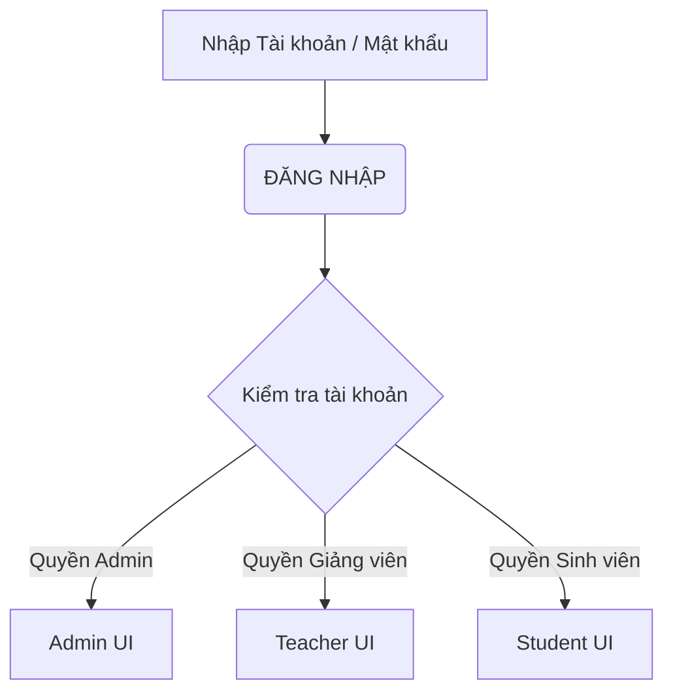
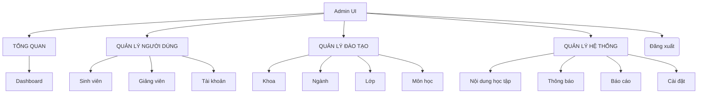
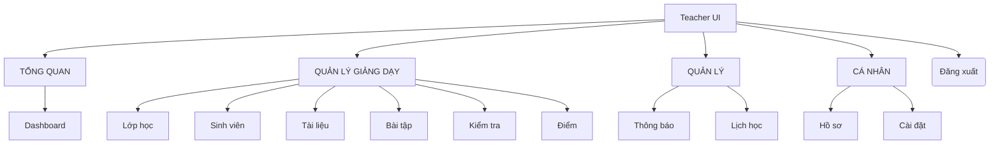
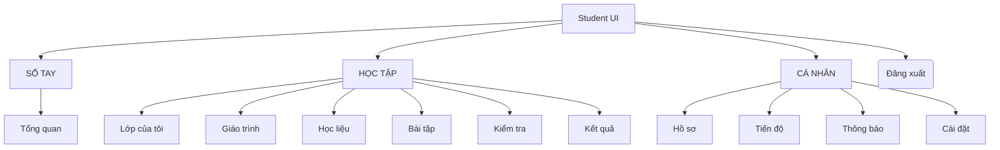

## 1. Khảo sát và xác định yêu cầu
Bảng mô tả bài toán
|Tiêu chí               |    Nội dung mô tả                                                                                                   |
|Bối cảnh               |    Nhu cầu tổ chức và tham gia học tập trên môi trường trực tuyến cho nhà trường, giảng viên và sinh viên.          |
|Thực trạng giải quyết  |    Khắc phục tình trạng quản lý phân tán thông tin người dùng,môn học, tài liệu giảng dạy, bài tập và theo dõi điểm |
|Giải pháp              |    Xây dựng Hệ thống Quản lý Học tập Trực tuyến để quản trị toàn bộ hoạt động dạy và học.                           |
Mục tiêu dự án
* Xây dựng nền tảng hỗ trợ học tập trực tuyến.
* Quản lý tập trung thông tin sinh viên, giảng viên và tài khoản toàn hệ thống.
* Quản lý môn học và khóa học có hệ thống.
* Cho phép giảng viên đăng tải bài giảng, tài liệu môn học, tạo bài tập, bài kiểm tra và chấm điểm.
* Cho phép sinh viên xem, tham gia khóa học, xem bài giảng, tải tài liệu, làm bài tập, làm bài kiểm tra và tra cứu điểm số.
* Theo dõi kết quả học tập của sinh viên và hỗ trợ quản trị viên quản lý toàn bộ hệ thống.
Phạm vi hệ thống
* Xây dựng hệ thống web hỗ trợ 3 đối tượng (Admin, Giảng viên, Sinh viên) thực hiện các chức năng: quản lý tài khoản, quản lý môn học và khóa học; đăng tải/xem bài giảng và tài liệu; tạo, làm và chấm điểm bài tập/bài kiểm tra; theo dõi kết quả học tập.
Danh sách tác nhân:
* Quản trị viên(Admin):Quản lý toàn bộ hệ thống, gồm tài khoản, giảng viên, sinh viên, môn học và khóa học.
* Giảng viên (Teacher): Phụ trách tạo và quản lý khóa học, đăng bài giảng, đăng tài liệu, tạo bài tập/kiểm tra, chấm điểm và theo dõi kết quả của sinh viên.
* Sinh viên (Student): Người học đăng ký/đăng nhập, xem và tham gia khóa học, học bài, tải tài liệu, làm bài tập/kiểm tra và xem kết quả.

## Phần 2: Phân tích hệ thống
### 1. Sơ đồ Luồng Đăng nhập và Phân quyền

### 2. Phân rã chức năng - Quản trị viên (Admin)

### 3. Phân rã chức năng - Giảng viên

### 4. Phân rã chức năng - Sinh viên

