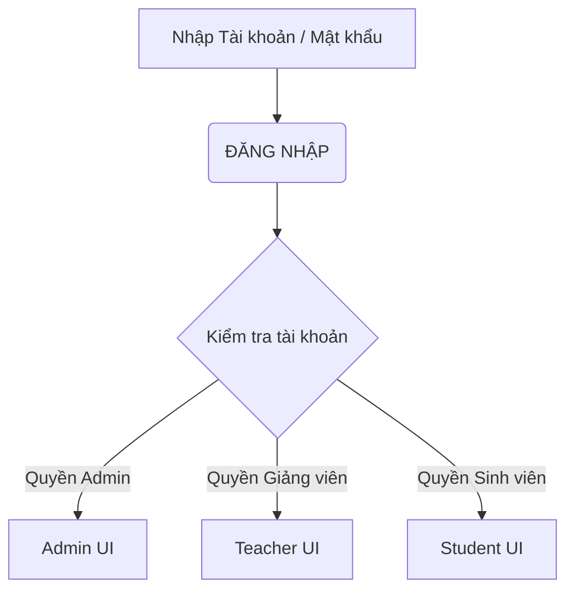
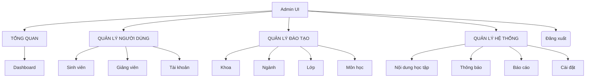
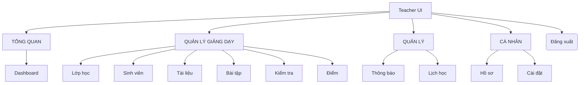
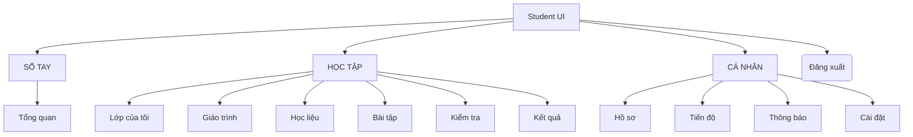

## Phần 2: Phân tích hệ thống
### 1. Sơ đồ Luồng Đăng nhập và Phân quyền

### 2. Phân rã chức năng - Quản trị viên (Admin)

### 3. Phân rã chức năng - Giảng viên

### 4. Phân rã chức năng - Sinh viên

