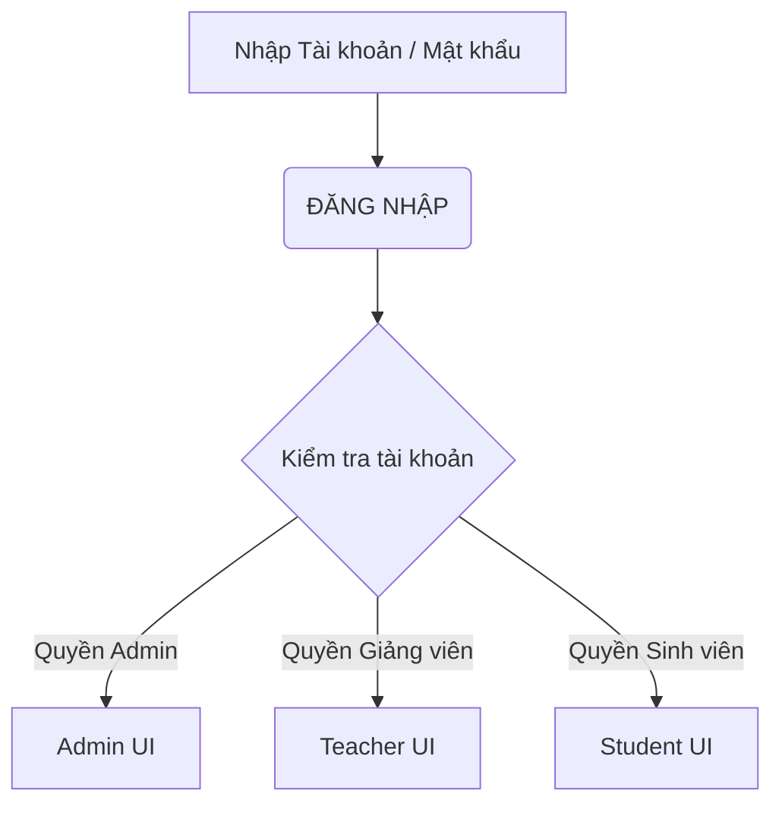
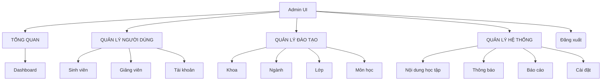
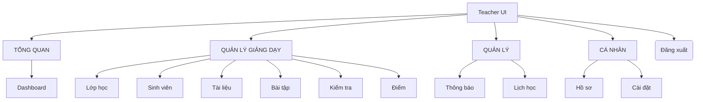
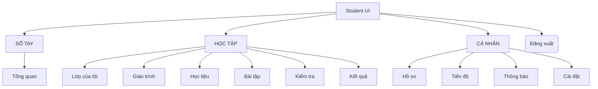

## Phần 1: Khảo sát và xác định yêu cầu
Bảng mô tả bài toán
### Bảng mô tả bài toán
| Tiêu chí | Nội dung mô tả |
| :--- | :--- |
| **Bối cảnh** | Nhu cầu tổ chức và tham gia học tập trên môi trường trực tuyến cho nhà trường, giảng viên và sinh viên. |
| **Thực trạng giải quyết** | Khắc phục tình trạng quản lý phân tán thông tin người dùng, môn học, tài liệu giảng dạy, bài tập và theo dõi điểm. |
| **Giải pháp** | Xây dựng Hệ thống Quản lý Học tập Trực tuyến để quản trị toàn bộ hoạt động dạy và học. |                      |
Mục tiêu dự án
* Xây dựng nền tảng hỗ trợ học tập trực tuyến.
* Quản lý tập trung thông tin sinh viên, giảng viên và tài khoản toàn hệ thống.
* Quản lý môn học và khóa học có hệ thống.
* Cho phép giảng viên đăng tải bài giảng, tài liệu môn học, tạo bài tập, bài kiểm tra và chấm điểm.
* Cho phép sinh viên xem, tham gia khóa học, xem bài giảng, tải tài liệu, làm bài tập, làm bài kiểm tra và tra cứu điểm số.
* Theo dõi kết quả học tập của sinh viên và hỗ trợ quản trị viên quản lý toàn bộ hệ thống.
Phạm vi hệ thống
* Xây dựng hệ thống web hỗ trợ 3 đối tượng (Admin, Giảng viên, Sinh viên) thực hiện các chức năng: quản lý tài khoản, quản lý môn học và khóa học; đăng tải/xem bài giảng và tài liệu; tạo, làm và chấm điểm bài tập/bài kiểm tra; theo dõi kết quả học tập.
Danh sách tác nhân:
* Quản trị viên(Admin):Quản lý toàn bộ hệ thống, gồm tài khoản, giảng viên, sinh viên, môn học và khóa học.
* Giảng viên (Teacher): Phụ trách tạo và quản lý khóa học, đăng bài giảng, đăng tài liệu, tạo bài tập/kiểm tra, chấm điểm và theo dõi kết quả của sinh viên.
* Sinh viên (Student): Người học đăng ký/đăng nhập, xem và tham gia khóa học, học bài, tải tài liệu, làm bài tập/kiểm tra và xem kết quả.

## Phần 2: Phân tích hệ thống
### 1. Sơ đồ Luồng Đăng nhập và Phân quyền

### 2. Phân rã chức năng - Quản trị viên (Admin)

### 3. Phân rã chức năng - Giảng viên

### 4. Phân rã chức năng - Sinh viên

## Phần 4: Triển khai và Kiểm thử

### 4.1. Môi trường triển khai
* **Mã nguồn & Quản lý phiên bản:** Git, GitHub.
* **Công cụ lập trình:** Visual Studio Code.
* **Kiểm thử API:** Postman.

### 4.2. Kết quả đạt được
* Xây dựng thành công hệ thống với 3 phân quyền hoạt động độc lập: **Admin**, **Giảng viên**, và **Sinh viên**.
* Hoàn thiện các luồng nghiệp vụ cốt lõi: Quản lý danh mục đào tạo, Đăng tải học liệu (Video, PDF), Quản lý bài tập/đề thi và Theo dõi kết quả học tập.

### 4.3. Kiểm thử hệ thống (Testing)
Quá trình kiểm thử được thực hiện để đảm bảo tính ổn định của hệ thống:
* **Kiểm thử giao diện (UI/UX):** Đảm bảo tính Responsive và các luồng thao tác (nhấp chuột, điền form) hoạt động đúng như thiết kế.
* **Kiểm thử API (Backend):** Sử dụng Postman để xác thực các endpoint, đảm bảo dữ liệu trả về chính xác (đặc biệt là API Đăng nhập và Nộp bài).
* **Kiểm thử luồng nghiệp vụ:**
  * Hệ thống tự động chặn truy cập (báo lỗi 403) khi sinh viên cố tình vào trang của giảng viên.
  * Tự động khóa thao tác và thu bài thi khi hết thời gian đếm ngược.

### 4.4. Hướng phát triển
* Nâng cấp hệ thống lưu trữ đám mây (Cloud Storage) để tối ưu băng thông tải video bài giảng.
* Tích hợp tính năng phòng học trực tuyến (Video Call) để tăng tính tương tác.
##3: THIẾT KẾ GIAO DIỆN
1. Mục tiêu

Thiết kế giao diện hệ thống quản lý học tập đơn giản, dễ sử dụng và phù hợp với từng loại người dùng.

Hệ thống gồm 3 giao diện chính:

👨‍🎓 Sinh viên

👨‍🏫 Giảng viên

👨‍💼 Quản trị viên

2. Giao diện đăng nhập

Người dùng nhập:

Tên đăng nhập

Mật khẩu

Chức năng:

Đăng nhập

Quên mật khẩu

┌─────────────────────────────────┐
│       🎓 QUẢN LÝ HỌC TẬP        │
│                                 │
│  Tên đăng nhập: [____________]  │
│  Mật khẩu:      [____________]  │
│                                 │
│          [  ĐĂNG NHẬP  ]        │
│                                 │
│          Quên mật khẩu?         │
└─────────────────────────────────┘

3. Giao diện sinh viên
Trang chủ

Hiển thị:

Thông tin sinh viên

Môn học

Thời khóa biểu

Điểm

Tài liệu

┌──────────────────────────────────────────────┐
│ 🎓 HỆ THỐNG QUẢN LÝ HỌC TẬP       👤 SV     │
├──────────────┬───────────────────────────────┤
│ 🏠 Trang chủ │                               │
│ 📚 Môn học   │       Xin chào, Sinh viên!   │
│ 📝 Đăng ký   │                               │
│ 📅 Lịch học  │   📚 Môn học: 6              │
│ 📊 Điểm      │   📝 Đã đăng ký: 5            │
│ 📖 Tài liệu  │   📊 GPA: 3.25                │
│ 🚪 Đăng xuất │                               │
└──────────────┴───────────────────────────────┘

4. Giao diện đăng ký môn học

Sinh viên có thể xem danh sách môn học và đăng ký.

Mã môn	Tên môn	Tín chỉ	Giảng viên	Sĩ số	Thao tác
CNTT01	Lập trình Web	3	Nguyễn Văn A	35/50	Đăng ký
CNTT02	Cơ sở dữ liệu	3	Trần Văn B	40/50	Đăng ký
CNTT03	Phân tích hệ thống	3	Lê Văn C	45/50	Đăng ký
5. Giao diện xem điểm
┌──────────────────────────────────────────────┐
│              📊 KẾT QUẢ HỌC TẬP              │
├────────┬─────────────────────┬───────────────┤
│ Mã môn │ Tên môn             │ Điểm          │
├────────┼─────────────────────┼───────────────┤
│ CNTT01 │ Lập trình Web       │ 8.5           │
│ CNTT02 │ Cơ sở dữ liệu       │ 7.8           │
│ CNTT03 │ Phân tích hệ thống  │ 9.0           │
└────────┴─────────────────────┴───────────────┘

              Điểm trung bình: 8.43

6. Giao diện giảng viên

Các chức năng chính:

🏠 Trang chủ

🏫 Lớp học

👥 Sinh viên

📖 Tài liệu

📊 Nhập điểm

👤 Thông tin cá nhân

🚪 Đăng xuất

┌──────────────────────────────────────────────┐
│ 🎓 QUẢN LÝ HỌC TẬP              👨‍🏫 GV      │
├──────────────┬───────────────────────────────┤
│ 🏠 Trang chủ │                               │
│ 🏫 Lớp học   │       Lớp học phần            │
│ 👥 Sinh viên  │                               │
│ 📖 Tài liệu  │  CNTT01 - Lập trình Web      │
│ 📊 Nhập điểm │  CNTT02 - Cơ sở dữ liệu      │
│ 🚪 Đăng xuất │                               │
└──────────────┴───────────────────────────────┘

7. Giao diện nhập điểm
Mã SV	Họ tên	Chuyên cần	Giữa kỳ	Cuối kỳ	Tổng
SV001	Nguyễn Văn A	9	8	9	8.7
SV002	Trần Văn B	8	7	8	7.7
SV003	Lê Văn C	10	9	9	9.3

Nút chức năng:

[ LƯU ĐIỂM ]    [ HỦY ]

8. Giao diện quản trị viên

Quản trị viên có quyền quản lý toàn bộ hệ thống.

┌──────────────────────────────────────────────┐
│ 🎓 QUẢN TRỊ HỆ THỐNG              👨‍💼 ADMIN │
├────────────────┬─────────────────────────────┤
│ 🏠 Trang chủ   │                             │
│ 👤 Tài khoản   │      Tổng quan hệ thống    │
│ 👨‍🎓 Sinh viên  │                             │
│ 👨‍🏫 Giảng viên │   Sinh viên: 500           │
│ 📚 Môn học     │   Giảng viên: 50            │
│ 🏫 Lớp học     │   Môn học: 80               │
│ 📊 Báo cáo     │   Lớp học phần: 120         │
│ 🚪 Đăng xuất   │                             │
└────────────────┴─────────────────────────────┘

9. Nguyên tắc thiết kế

Giao diện đơn giản, dễ sử dụng.

Thiết kế Responsive cho máy tính và điện thoại.

Màu sắc thống nhất.

Các chức năng được phân quyền rõ ràng.

Thông tin quan trọng được hiển thị dễ nhìn.

Có thông báo khi thêm, sửa, xóa hoặc đăng ký dữ liệu.

Hạn chế thao tác dư thừa.

10. Màu sắc chủ đạo
Primary:   #2563EB  🔵
Success:   #16A34A  🟢
Warning:   #F59E0B  🟡
Danger:    #DC2626  🔴
Background:#F8FAFC  ⚪
Text:      #1E293B  ⚫

11. Cấu trúc giao diện
                HỆ THỐNG QUẢN LÝ HỌC TẬP
                           │
              ┌────────────┼────────────┐
              │            │            │
              ▼            ▼            ▼
          Sinh viên     Giảng viên     Admin
              │            │            │
              ▼            ▼            ▼
          Trang chủ     Trang chủ    Dashboard
          Môn học       Lớp học      Người dùng
          Đăng ký       Tài liệu     Sinh viên
          Lịch học      Nhập điểm    Giảng viên
          Điểm          Sinh viên    Môn học
          Tài liệu                    Lớp học

12. Kết quả

Giao diện được thiết kế theo từng nhóm người dùng, giúp:

Sinh viên dễ dàng theo dõi quá trình học tập.

Giảng viên quản lý lớp và điểm.

Quản trị viên quản lý toàn bộ hệ thống.

Thiết kế giao diện là cơ sở để triển khai Frontend của hệ thống.
