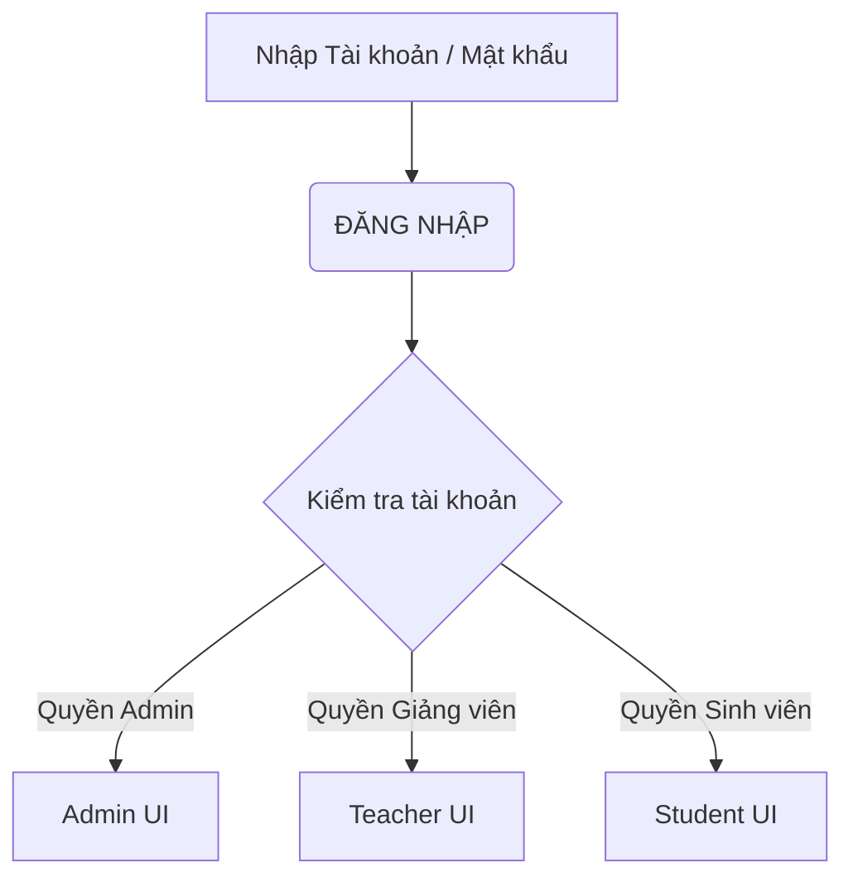
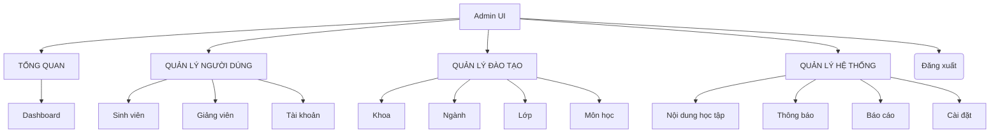
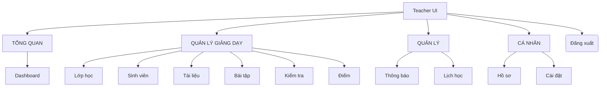
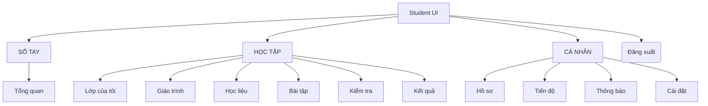

## Phần 1: Khảo sát và xác định yêu cầu
Bảng mô tả bài toán
### Bảng mô tả bài toán
| Tiêu chí | Nội dung mô tả |
| :--- | :--- |
| **Bối cảnh** | Nhu cầu tổ chức và tham gia học tập trên môi trường trực tuyến cho nhà trường, giảng viên và sinh viên. |
| **Thực trạng giải quyết** | Khắc phục tình trạng quản lý phân tán thông tin người dùng, môn học, tài liệu giảng dạy, bài tập và theo dõi điểm. |
| **Giải pháp** | Xây dựng Hệ thống Quản lý Học tập Trực tuyến để quản trị toàn bộ hoạt động dạy và học. |                      |

Mục tiêu dự án
* Xây dựng nền tảng hỗ trợ học tập trực tuyến.
* Quản lý tập trung thông tin sinh viên, giảng viên và tài khoản toàn hệ thống.
* Quản lý môn học và khóa học có hệ thống.
* Cho phép giảng viên đăng tải bài giảng, tài liệu môn học, tạo bài tập, bài kiểm tra và chấm điểm.
* Cho phép sinh viên xem, tham gia khóa học, xem bài giảng, tải tài liệu, làm bài tập, làm bài kiểm tra và tra cứu điểm số.
* Theo dõi kết quả học tập của sinh viên và hỗ trợ quản trị viên quản lý toàn bộ hệ thống.

Phạm vi hệ thống
* Xây dựng hệ thống web hỗ trợ 3 đối tượng (Admin, Giảng viên, Sinh viên) thực hiện các chức năng: quản lý tài khoản, quản lý môn học và khóa học; đăng tải/xem bài giảng và tài liệu; tạo, làm và chấm điểm bài tập/bài kiểm tra; theo dõi kết quả học tập.

Danh sách tác nhân:
* Quản trị viên(Admin):Quản lý toàn bộ hệ thống, gồm tài khoản, giảng viên, sinh viên, môn học và khóa học.
* Giảng viên (Teacher): Phụ trách tạo và quản lý khóa học, đăng bài giảng, đăng tài liệu, tạo bài tập/kiểm tra, chấm điểm và theo dõi kết quả của sinh viên.
* Sinh viên (Student): Người học đăng ký/đăng nhập, xem và tham gia khóa học, học bài, tải tài liệu, làm bài tập/kiểm tra và xem kết quả.

## Phần 2: Phân tích hệ thống
### 1. Sơ đồ Luồng Đăng nhập và Phân quyền

### 2. Phân rã chức năng - Quản trị viên (Admin)

### 3. Phân rã chức năng - Giảng viên

### 4. Phân rã chức năng - Sinh viên

## Phần 4: Triển khai và Kiểm thử

### 4.1. Môi trường triển khai
* **Mã nguồn & Quản lý phiên bản:** Git, GitHub.
* **Công cụ lập trình:** Visual Studio Code.
* **Kiểm thử API:** Postman.

### 4.2. Kết quả đạt được
* Xây dựng thành công hệ thống với 3 phân quyền hoạt động độc lập: **Admin**, **Giảng viên**, và **Sinh viên**.
* Hoàn thiện các luồng nghiệp vụ cốt lõi: Quản lý danh mục đào tạo, Đăng tải học liệu (Video, PDF), Quản lý bài tập/đề thi và Theo dõi kết quả học tập.

### 4.3. Kiểm thử hệ thống (Testing)
Quá trình kiểm thử được thực hiện để đảm bảo tính ổn định của hệ thống:
* **Kiểm thử giao diện (UI/UX):** Đảm bảo tính Responsive và các luồng thao tác (nhấp chuột, điền form) hoạt động đúng như thiết kế.
* **Kiểm thử API (Backend):** Sử dụng Postman để xác thực các endpoint, đảm bảo dữ liệu trả về chính xác (đặc biệt là API Đăng nhập và Nộp bài).
* **Kiểm thử luồng nghiệp vụ:**
  * Hệ thống tự động chặn truy cập (báo lỗi 403) khi sinh viên cố tình vào trang của giảng viên.
  * Tự động khóa thao tác và thu bài thi khi hết thời gian đếm ngược.

### 4.4. Hướng phát triển
* Nâng cấp hệ thống lưu trữ đám mây (Cloud Storage) để tối ưu băng thông tải video bài giảng.
* Tích hợp tính năng phòng học trực tuyến (Video Call) để tăng tính tương tác.
#### 3. THIẾT KẾ GIAO DIỆN

Hệ thống quản lý học tập
1. Giới thiệu
Hệ thống quản lý học tập (LMS) được xây dựng nhằm hỗ trợ sinh viên, giảng viên và quản trị viên trong việc quản lý quá trình học tập.
2. Đối tượng sử dụng
Sinh viên: Xem khóa học, học bài, làm bài tập, xem điểm và theo dõi tiến độ.
Giảng viên: Quản lý khóa học, tạo bài tập, chấm điểm và theo dõi sinh viên.
Quản trị viên: Quản lý tài khoản, khóa học và các chức năng của hệ thống.
3. Thiết kế giao diện
Giao diện được thiết kế theo hướng đơn giản, dễ sử dụng và dễ mở rộng.
Dashboard
Hiển thị các thông tin chính:
Khóa học đang tham gia
Tiến độ học tập
Bài tập sắp đến hạn
Lịch học
Thông báo
Quản lý khóa học
Sinh viên có thể xem nội dung bài học, tài liệu và tiến độ.
Giảng viên có thể tạo, chỉnh sửa và quản lý nội dung khóa học.
Bài tập và kiểm tra
Sinh viên làm và nộp bài.
Giảng viên chấm điểm và nhận xét.
Hệ thống hiển thị kết quả sau khi hoàn thành.
Quản lý điểm
Hiển thị:
Điểm từng bài tập
Điểm kiểm tra
Điểm trung bình
Kết quả học tập
Quản lý người dùng
Quản trị viên có thể:
Quản lý sinh viên
Quản lý giảng viên
Quản lý tài khoản
Phân quyền người dùng
4. Điều hướng giao diện
Dashboard
├── Khóa học
├── Bài tập
├── Điểm số
├── Lịch học
├── Thông báo
└── Cài đặt
5. Nguyên tắc UI/UX
Giao diện đơn giản, trực quan.
Bố cục rõ ràng và nhất quán.
Màu sắc và font chữ dễ đọc.
Responsive trên máy tính và điện thoại.
Các chức năng được phân quyền theo từng loại người dùng.
6. Mục tiêu
Hệ thống hướng tới việc tạo ra một môi trường học tập trực tuyến thuận tiện, giúp người dùng dễ dàng quản lý khóa học, bài tập, điểm số và tiến độ học tập.
